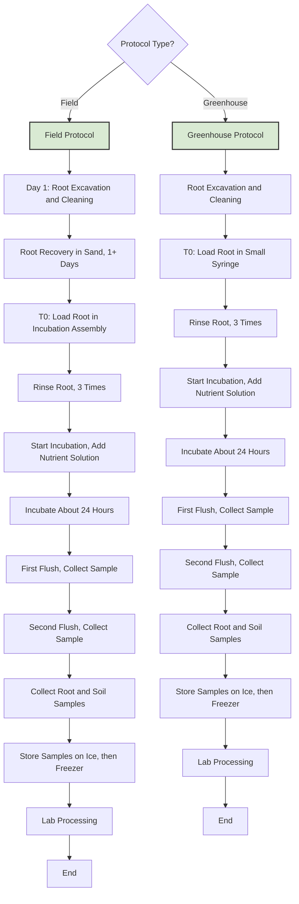

### Quick protocol overview

```mermaid
flowchart TD
    B{Protocol Type?}
    B -->|Field| C1[Field Protocol]
    B -->|Greenhouse| C2[Greenhouse Protocol]

    %% Field protocol steps
    C1 --> D1[Day 1: Root Excavation and Cleaning]
    D1 --> E1[Root Recovery in Sand, 1+ Days]
    E1 --> F1[T0: Load Root in Incubation Assembly]
    F1 --> G1[Rinse Root, 3 Times]
    G1 --> H1[Start Incubation, Add Nutrient Solution]
    H1 --> I1[Incubate About 24 Hours]
    I1 --> J1[First Flush, Collect Sample]
    J1 --> K1[Second Flush, Collect Sample]
    K1 --> X1[Collect Root and Soil Samples]
    X1 --> L1[Store Samples on Ice, then Freezer]
    L1 --> N1[Lab Processing]
    N1 --> O1[End]

    %% Greenhouse protocol steps
    C2 --> D2[Root Excavation and Cleaning]
    D2 --> E2[T0: Load Root in Small Syringe]
    E2 --> F2[Rinse Root, 3 Times]
    F2 --> G2[Start Incubation, Add Nutrient Solution]
    G2 --> H2[Incubate About 24 Hours]
    H2 --> I2[First Flush, Collect Sample]
    I2 --> J2[Second Flush, Collect Sample]
    J2 --> X2[Collect Root and Soil Samples]
    X2 --> K2[Store Samples on Ice, then Freezer]
    K2 --> M2[Lab Processing]
    M2 --> O2[End]

    classDef protocol fill:#d9ead3,stroke:#333,stroke-width:2px;
    class C1,C2 protocol;
```